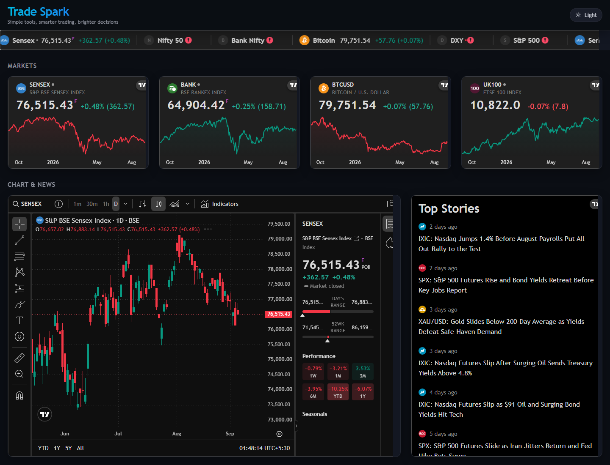

# Trade Spark

Simple tools, smarter trading, brighter decisions.

A live market dashboard for Indian indices and global markets. Charts, heatmap, movers, and technicals come from TradingView widgets. The app is a static Progressive Web App — install it from the browser and use it like a standalone window.



## Features

- Dark theme by default, with a light/dark toggle
- Live ticker for Sensex, Nifty 50, Bank Nifty, Bitcoin, DXY, and S&P 500
- Mini overviews for Sensex, Bankex, BTC, and FTSE 100
- Advanced Sensex chart with details, hotlist, and SMA
- Market news, BSE hotlists, and Sensex sector heatmap
- Technical ratings for Sensex, Nifty, Bank Nifty, and Nifty MidCap 100
- Installable PWA with offline shell (market widgets still need a network connection)

## Run locally

Open the files over HTTP. A service worker cannot register from a `file://` URL.

```bash
python -m http.server 8765
```

Then visit [http://127.0.0.1:8765/](http://127.0.0.1:8765/).

## Install as an app

1. Serve the site locally or open the deployed URL.
2. In Chrome or Edge, use **Install app** / **Add to Home Screen**.
3. On iOS Safari, use **Share → Add to Home Screen**.

The home-screen icon uses the Trade Spark mark. Maskable icons are included so Android can crop the icon to a circle or squircle.

## Deploy

The site is static. Any static host works (for example Vercel, Netlify, or GitHub Pages). Keep these files at the site root:

- `index.html`
- `manifest.webmanifest`
- `sw.js`
- `favicon.svg` / `favicon.ico`
- `icons/`
